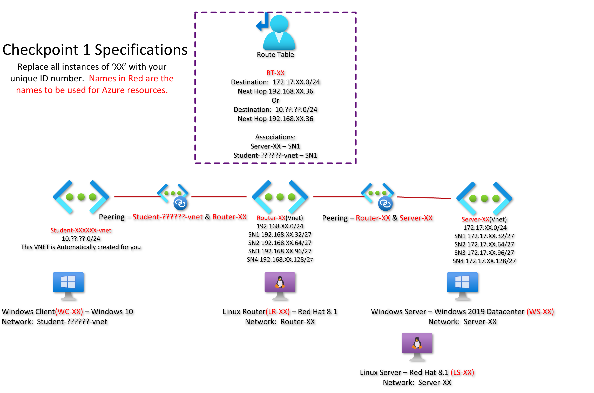

# Pre-Checkpoint1 Submission

- **COURSE INFORMATION📋: CSN400(Computer Systems Project)**
- **STUDENT’S NAME :student: : Keshav Raj Ghimire**
- **STUDENT'S NUMBER🔢: 162575195**
- **GITHUB USER_ID🆔: myseneca-162575195**
- **TEACHER’S NAME👩‍🏫: Atoosa Nasiri**
---
---
## Table of Contents

1. [Network Topology](#network-topology)
2. [Single Line Code Snippet](#single-line-code-snippet)
3. [Bash Script](#bash-script)
4. [Json Object](#json-object)
5. [Sample Table](#sample-table)
6. [Sample Hyperlink](#sample-hyperlink)
---
### Network Topology



---
### Single Line Code Snippet

`echo "Hi, Todays date is: $(date +%F). Have a good day." `

---
### Bash Script

```bash
#!/bin/bash
# A bash script
# Start
read -p 'What is your name?: ' name # asks for a user input from a user
read -p 'Please enter your section name of CSN400: ' section # asks user for their CSN400 section

echo Hi Class, $name is from CSN400$section. #Provides output
# end
```
---
### Json object

- Since I'm not that great with JSON, I will provide a very short example.
```json
{"Classes":["MST400","CSN400","CSN405","EAC594","OPS445","PMC115"],"name":"Keshav Raj Ghimire","Studentid":162575195}
```
---
### Sample Table

|  Courses Taken by me in 4th sem | Instructors |
| :-----------: | :-----------: |
| CSN400      | Atoosa Nasiri, Scott Apted     |
| CSN405      | Ali Abdulsattar Hussein        | 
| EAC594      | Garry Smolyansky               |
| MST400      | Nooshin Beheshti               |
| OPS445      | Ben Singh                      |
| PMC115      | Shaoli Bhanja                  |

---
### Sample Hyperlink

 **Please use this link to see one of my project demonstration on youtube🔽:**
- [Human Detection Camera For IoT Project](https://youtu.be/ISxlRd-fwXY)
