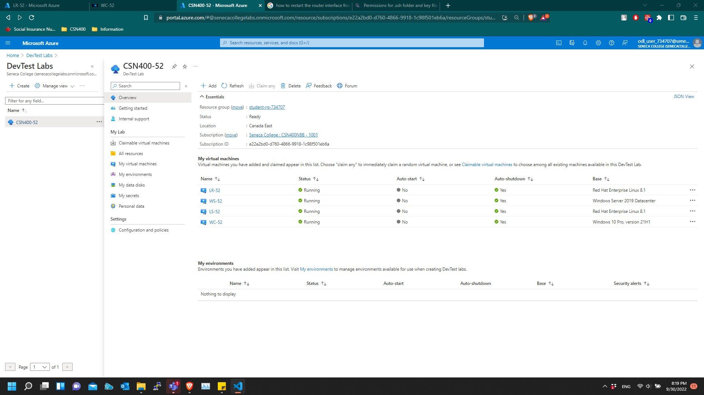
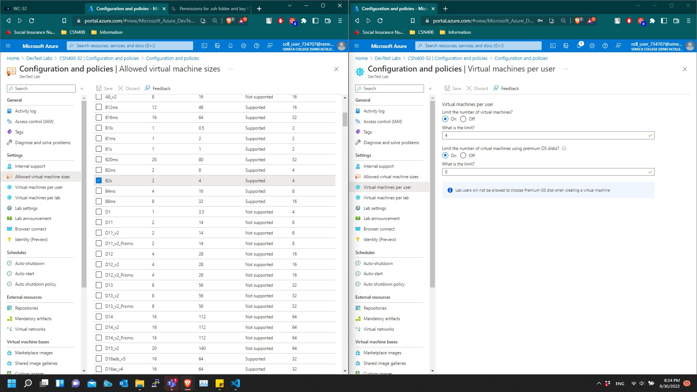

# Pre-Checkpoint2 Submission

- **COURSE INFORMATION📋: CSN400(Computer Systems Project)**

---
---

## Table of Contents

- [Pre-Checkpoint2 Submission](#pre-checkpoint2-submission)
  - [Table of Contents](#table-of-contents)
    - [DevTest Lab Configuration](#devtest-lab-configuration)
    - [Step by step guide to create and configure each of you VMs through Portal](#step-by-step-guide-to-create-and-configure-each-of-you-vms-through-portal)
    - [Basic Connectivity between all machines](#basic-connectivity-between-all-machines)
    - [Extra steps, configurations ans services required to get all machines connected to Windows Client](#extra-steps-configurations-ans-services-required-to-get-all-machines-connected-to-windows-client)
    - [Demostration of connectivity](#demostration-of-connectivity)
    - [Conclusion](#conclusion)

---

### DevTest Lab Configuration
**Below is my DevTest Lab Configuration**

1. Screenshot of Overview of DevTest Lab, CSN400-52
   

2. Screenshots of Policies & Configuration - Allowed VMSKU & User Per VM:
     
3. Screenshots of Policies & Configuration - Allowed Vnets & Lab Settings:
   

### Step by step guide to create and configure each of you VMs through Portal

---

**Below are the steps used to create and configure each of my VMs**

* Windows VM (WC-52)

1. Go to Home> Search for the DevTest Lab that you created and move to Lab > Click My Virtual machines under My Lab > Add > Choose `Windows 10 Pro, version 21H2` > fillup mandatory field (*). Unselect :Use a saved Secret". Then Fillup apppropriate passwords. > Select Advanced Settings> Choose "Student-734707-vnet" and leave rest as default.
    
    - We are creating resrouces inside the DevTestLab because all the VMs we create outside of the lab will not implement the policies and configurations we set up for DevTest Environment. It limits our options and make resource creation extremly easier.

* Linux VM (LR-52)
1. Go to Home > Search for DevTest Lab that you created and Select > Click my Virtual machines > Add > Choose `Red Hat Enterprise Linux 8.1` > fillup required fields  > Choose `SSH Public Key` as Authentication Type > Uncheck "Use a saved Secred" > Configure ssh to connect with your Linux Router > Go to Advanced Settings > Choose "Router-52"

   * To connect with ssh, we have to create a key pair using any linux machine (Azure CLI can work as well) using this following command: `ssh-keygen -m PEM -t rsa -b 2048`
   * Paste the contents of public key into the "SSH public key" box
   * Keep private key in a secure location which we will use to connect with our Linux VMs

* Linux Server (LS-52)
   
1. Follow the same steps to Create LS-52 and use the same key pairs for this VM as well but please change things below ### Very Important ###
   
   * Name: LS-52
   * VNET: Server - 52
  
* Windows Server (WS-52)
  
1. Follow the same steps to Create LS-52 and make this minor but ###VERY IMPORTANT ### changes:
   * Name: WS-52
   * VNET: Server - 52 

---

### Basic Connectivity between all machines

   ***Well, we have configured our DevTestLab in such a way that our VMs won't have public IP Address and won't be able to communicate other ways rather than using "Bastion". Bastion only provides access to Client VM (WC-52). There may be questions "How??". To answer this question, our three VNETs are peered to form a private network topology. We have setup Route Tables (RT-52) for our traffic to roam around our network topology and associated those route tables with our proper subnet of our VNETs in each VNETs (SN1). After that, we have to import our private key to "WC-52" in order to connect with our Linux Router (LR-52) and inside the Router VM (LR-52) to connect with Linux Server (LS-52). This is all but a basic connectivity that provides us with connection from WC-52 to LR-52 but not from WC-52 to LS-52 & WS-52 directly. The main Reason our Packets are not reaching from client to server is because linux router is not forwarding traffic to server side since this acts as a middle man!!***

---

### Extra steps, configurations ans services required to get all machines connected to Windows Client
  ***Since we established basic connectivity, we need to make our Server Accessible by our client VM. We know WC-LR and LR-WS/LS connections is good and these are the following steps I took to make our WC talk with our Server in Server-52 VNET.*** 
  
   i. Navigate to Networking Pane of LS-52> Clikc on "Network Interface" > Got to "IP configurations" > Enable IP forwarding.
   
   ii. I have also edited /etc/sysctl.conf in LR-52 and added `net.ipv4.ip_forward = 1` to allow our traffic through Router. 
   iii. We have to enable the install the iptables rules and disable the firewall services in Linux Router to establish the connectivity. Commands: `systemctl stop firewalld` , `systemctl disable firewalld` and `systemctl status firewalld` .

---

### Demostration of connectivity

I would use combination of Screenshots and a link to Pcap.file which you can download to see the connectivity between all my VMs.

1. SSH Connection from WC-52 to LR-52
   

2. SSH Connection from WC-52 to LS-52
   

3. RDP Connection from WC-52 to WS-52
   

   ***Note:*** Please click the link to download the filtered wireshark capture (.pcap) file to see the packet traffic during the connection: 
    [Wireshark Capture for people of seneca college](https://seneca-my.sharepoint.com/:u:/g/personal/krghimire_myseneca_ca/EfbUeLYNj6pEld5Z89Zh0nMBui9h2sULzY-iezDdmkUZuA?e=vzOyGe)

---

### Conclusion

    * From this lesson, I have know learned how we can do port forwarding to access our lab environment using Port Forwarding making Linux VM act as a Router. This was great learning experience in terms of setup and configuration of DevTestLab. It is a great piece of knowledge. Making VMs inside the DevTestLab is so easy and fast.
